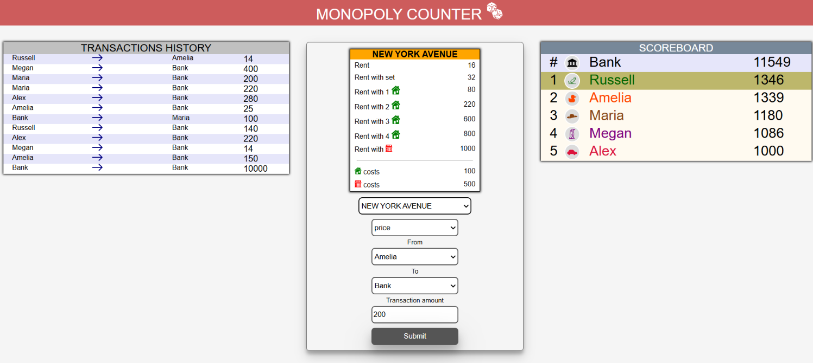

# 🎲 monopolyCounter — React Financial Manager for Board Games

A web application designed to automate and streamline "cash" financial transactions between players and the bank in the classic board game "Monopoly." This project eliminates the need for paper play money by introducing digital banking, which significantly accelerates gameplay and eradicates manual math errors. The application has been thoroughly and successfully stress-tested within a friendly circle across various player counts.

👉 **[Live Demo Application](https://OlehKuts.github.io./monopolyCounter)**

---

## 📷 Gameplay Interface (Playing Process)



---

## ✨ Features & Interface Structure

The layout is split into three core functional sections optimized for a single designated player (the banker) or an outside moderator to manage all funds seamlessly:

1. **Main Section:**
   - **Pre-game Setup:** Create customized player profiles with selected unique tokens prior to launching the session.
   - **Smart Transaction Constructor:** Generate real-time financial actions utilizing an embedded database of city-cards (objects) containing identical parameters to the authentic American Monopoly game.
   - **Automated Calculations:** Transaction values (property purchases, rent, house/hotel construction, taxes, fines, etc.) populate automatically based on the chosen card configuration and entities involved (e.g., player-to-bank or player-to-player). Confirmed transactions instantly recalculate balances.

2. **Transaction History:**
   - A ledger displaying a chronological audit trail of all financial movements, monetary charges, and credits executed throughout the match.

3. **Scoreboard:**
   - A dynamic leaderboard where players are automatically sorted in descending order according to their current account balances.
   - Real-time monitoring of total capital remaining inside the Bank.

---

## 🛠️ Tech Stack

- **Core Library:** React (Functional Components approach).
- **State Management:**
  - `useReducer` — centralizes complex multi-party transaction computations and financial ledger state logic.
  - `Context API` — provides deep global data distribution of banking states without prop drilling.
- **Data Validation:** `ajv` (validates complex transaction schemas and player property inputs).
- **Deployment:** GitHub Pages.

---

## 🚀 Local Installation and Setup

Follow these steps to run the project locally on your machine:

1. **Clone the repository:**

   ```bash
   git clone github.com
   ```

2. **Navigate to the project directory:**

   ```bash
   cd monopolyCounter
   ```

3. **Install dependencies:**

   ```bash
   npm install --legacy-peer-deps
   ```

4. **Start the local development server:**
   ```bash
   npm start
   ```
   _The application will automatically open in your browser at [http://localhost:3000](http://localhost:3000)._

---

## 👤 Author

_Developed by [Oleh Kuts](https://github.com/OlehKuts)_
